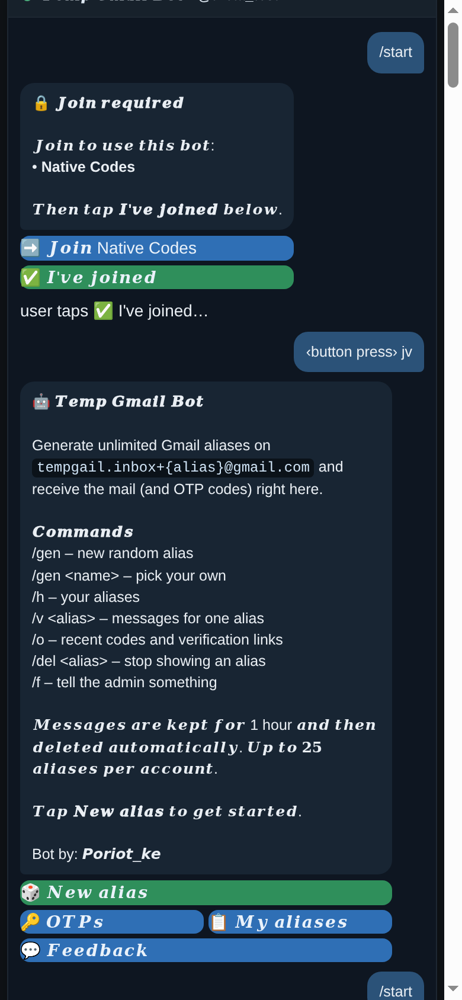
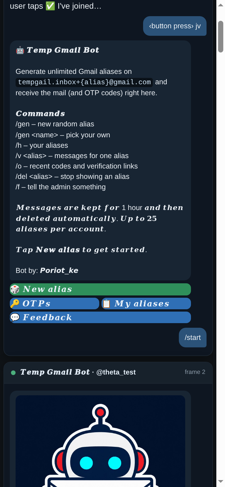
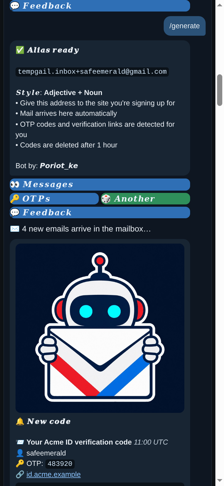
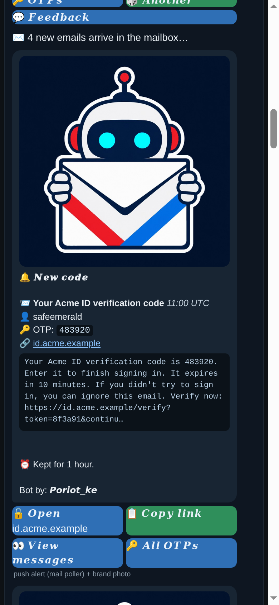
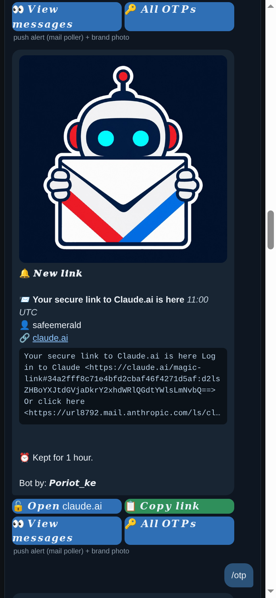
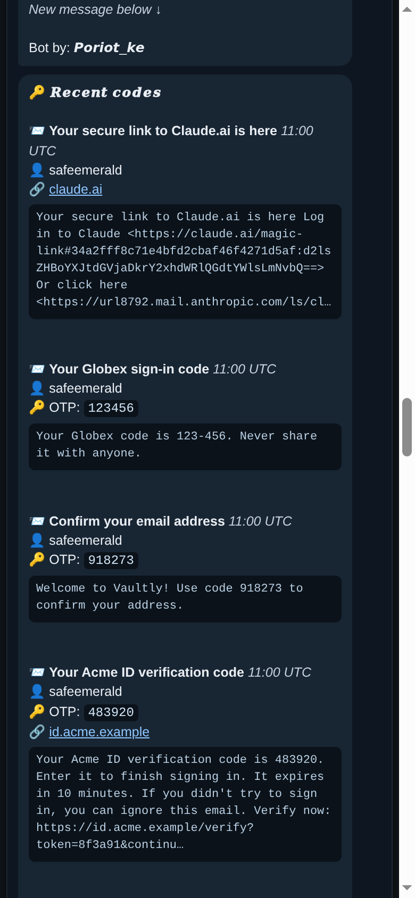
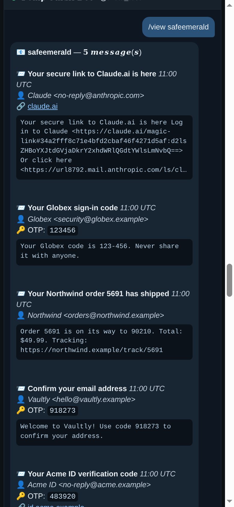
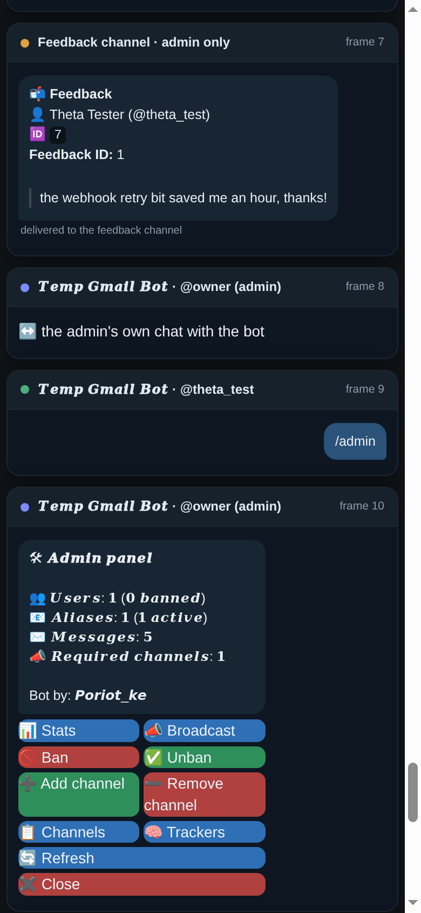
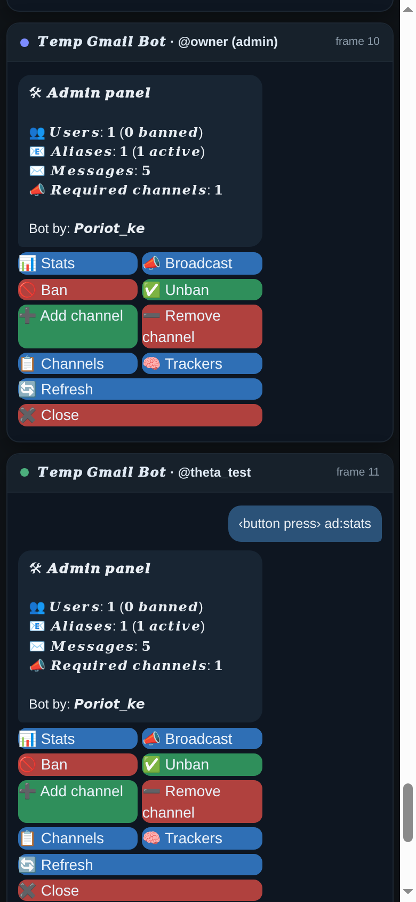

# 𝑻𝒆𝒎𝒑 𝑮𝒎𝒂𝒊𝒍 𝑩𝒐𝒕

I'm **PORIOT PKEMOI** (CTO). I built this bot: it gives you Gmail plus-aliases
(`you+alias@gmail.com`), watches the mailbox over IMAP, and sends each new email
to you in Telegram with the OTP code and verification links already extracted.

**Dev contact:** Telegram [@Poriot_ke](https://t.me/Poriot_ke) · Channel [@nativecodes](https://t.me/nativecodes)

I can require users to join my channels first — until they do, the bot answers
with a join prompt and nothing else. I manage that list from inside Telegram.

## Screenshots

<p align="center">
  
  
  
</p>
<p align="center">
  
  
  
</p>
<p align="center">
  
  
  
</p>

Rendered from the bot's own output (`preview/preview.png` = full session), not
mockups. They show rendering and logic — a live run proves your credentials.

## Quick start

You need four things:

1. **Bot token** — [@BotFather](https://t.me/BotFather) → `/newbot`.
2. **Your Telegram user id** — [@userinfobot](https://t.me/userinfobot). Gets `/ban`, `/unban`, `/broadcast`, `/stats`.
3. **A feedback channel id** (e.g. `-1001234567890`) with the bot added as admin or member.
4. **Gmail App Password** — [docs/GMAIL_SETUP.md](docs/GMAIL_SETUP.md). A normal
   account password will not work. There is no IMAP switch to enable.

```bash
pip install -r requirements.txt
cp .env.example .env        # fill in the four values above
python tools/check_gmail.py # verifies Gmail before you start
python run.py
```

Then send `/start` to your bot.

## Commands

The bot registers these with Telegram on startup — no BotFather setup.

Short commands; the long spellings still work as aliases.

| Command | Alias | What it does |
| --- | --- | --- |
| `/start`, `/help` | | welcome + menu (with brand photo) |
| `/gen [name]` | `/generate` | new alias, random or your own |
| `/o` | `/otp` | recent codes and links (with brand photo) |
| `/h` | `/history` | your aliases, delete/restore |
| `/v <alias> [page]` | `/view` | messages for one alias |
| `/del <alias>` | `/delete` | deactivate an alias |
| `/f` | `/feedback` | send text or a screenshot to the admin |
| `/cancel` | | leave feedback mode |
| `/admin` | **admin panel** — colour-coded inline buttons for every admin action |
| `/channels` | list required channels, remove them with one tap |
| `/addchannel <@handle> [link]` | require a channel before the bot answers |
| `/delchannel <@handle\|id\|number>` | stop requiring a channel |
| `/trackers` | learned click-wrapper patterns, with one-tap undo |
| `/stats`, `/ban`, `/unban`, `/broadcast` | admin only (also on the panel) |

Send a plain word and it asks before creating an alias. `/ban`, `/unban`,
`/broadcast` and `/addchannel` also run from the panel — it asks for the value.

**Tracker learning (optional):** with `USE_AI_LINK_FALLBACK=true` the bot asks the
model about a mail only when two or more links have unknown wrapper status, sends
**redacted** URLs (host, path and parameter names — never a token), and stores the
wrapper's host pattern so every later mail is handled offline. `/trackers` shows
what was learned and undoes it. It is a teacher, never a runtime dependency: if
the API is down, nothing is learned and nothing breaks. `USE_AI_OTP_FALLBACK` is
different — it sends up to 4000 characters of the raw body, so I leave it off.

**Force-join:** users must be in every required channel before any command works.
The owner is never blocked, and if a channel cannot be checked (bot not admin,
channel deleted) the user is let through and it is logged, so I can't lock
everyone out by accident.

## Look

My own headings and button labels render in the brand font
(`𝑻𝒆𝒎𝒑 𝑮𝒎𝒂𝒊𝒍 𝑩𝒐𝒕`): codes, aliases, subjects and links always stay plain ASCII
so they remain copyable and clickable. Buttons are colour-coded — 🟢 green for the
main action, 🔵 blue for navigation, 🔴 red for anything destructive. Colour needs a
Telegram client from February 2026 or newer; older ones draw their default colour,
which is why every label also reads on its own. `STYLED_FONT=false` turns the font
off if a client shows boxes instead of letters.

## Settings

Everything is env config — I never hardcode it.

| Variable | Default | Purpose |
| --- | --- | --- |
| `BOT_TOKEN` | — | from BotFather |
| `GMAIL_EMAIL` | — | mailbox that receives the aliases |
| `GMAIL_APP_PASSWORD` | — | 16 characters; spaces are stripped, so paste as Google shows it |
| `ADMIN_USER_ID` | — | your Telegram id |
| `FEEDBACK_CHANNEL_ID` | — | where `/feedback` lands |
| `DB_PATH` / `LOG_PATH` | `data/` | keep these on a volume in the cloud |
| `MESSAGE_TTL_SECONDS` | `3600` | how long codes stay readable |
| `POLL_INTERVAL_SECONDS` | `10` | IMAP poll interval |
| `INITIAL_LOOKBACK_DAYS` | `1` | how far back the first poll looks |
| `MAX_ALIASES_PER_USER` / `GENERATE_PER_HOUR` | `25` / `20` | per-user limits |
| `IMAP_MAILBOX` | `INBOX` | set `[Gmail]/All Mail` if a filter archives alias mail |
| `FORCE_JOIN` | `true` | require channel membership before the bot answers |
| `REQUIRED_CHANNELS` | empty | seed list, comma-separated: `@nativecodes,-1001234567890` (the `@` is optional; then manage with `/addchannel`) |
| `MEMBERSHIP_CACHE_SECONDS` | `300` | how long a membership result is trusted |
| `BOT_BRAND_NAME` | `𝑻𝒆𝒎𝒑 𝑮𝒎𝒂𝒊𝒍 𝑩𝒐𝒕` | name in the welcome, description and captions |
| `BOT_CREDIT` | `𝙋𝙤𝙧𝙞𝙤𝙩_𝙠𝙚` | rendered as `Bot by: …` on every message |
| `BOT_PHOTO_PATH` / `SEND_BRAND_PHOTO` | bundled image / `true` | photo on `/start` and OTP alerts |
| `STYLED_FONT` | `true` | brand font on the bot's own text (off = plain ASCII) |
| `OPENROUTER_API_KEY` | empty | key for the optional AI helpers below |
| `USE_AI_LINK_FALLBACK` | `false` | let the AI spot unknown click wrappers, then remember the host pattern |
| `LINK_JUDGE_MODEL` | `openai/gpt-4o-mini` | model used for that classification |
| `USE_AI_OTP_FALLBACK` | `false` | last-resort OTP extraction — sends raw email body, see note |

## How it works

Add the bot as an **admin in the channel** so join checks work. Alias mail is
matched by tag, stored in SQLite, and pushed to the owner of that alias. Polling tracks the last IMAP UID and opens the mailbox **read-only** — your
unread state is never touched, and a message you open on your phone first still
reaches the bot. Duplicates are dropped by RFC `Message-ID`, codes expire after
`MESSAGE_TTL_SECONDS`, and OTP detection is scored, so a wrong code is never
preferred over no code.

## Deploy

| Platform | Works? |
| --- | --- |
| Railway | ✅ easiest — see [docs/DEPLOYMENT.md](docs/DEPLOYMENT.md) |
| Any VPS | ✅ cheapest long-term (`deploy/gmailbot.service`) |
| Docker / Fly / Render worker | ✅ `Dockerfile` included |
| Plesk | ✅ as a persistent process |
| Shared cPanel (Hostnin Cloud/Web, etc.) | ⚠️ no — no supervisor for background workers |
| Serverless | ❌ nothing keeps the poll loop alive |

It is one long-running process: **1 replica**, and persist `DB_PATH` on a volume.

## Tests

```bash
pip install -r requirements-dev.txt
python -m pytest -q            # 147 passed, no network or token needed
```

Covers config validation, the SQLite concurrency regression, alias ownership,
IMAP cursor behaviour, OTP true/false positives, escaping, and the full
Gmail → Telegram pipeline. `evidence/reproduce_bug_report.py` shows the bugs the
original single-file version had.

---

**Dev:** PORIOT PKEMOI, CTO — Telegram [@Poriot_ke](https://t.me/Poriot_ke) ·
Channel [@nativecodes](https://t.me/nativecodes)
